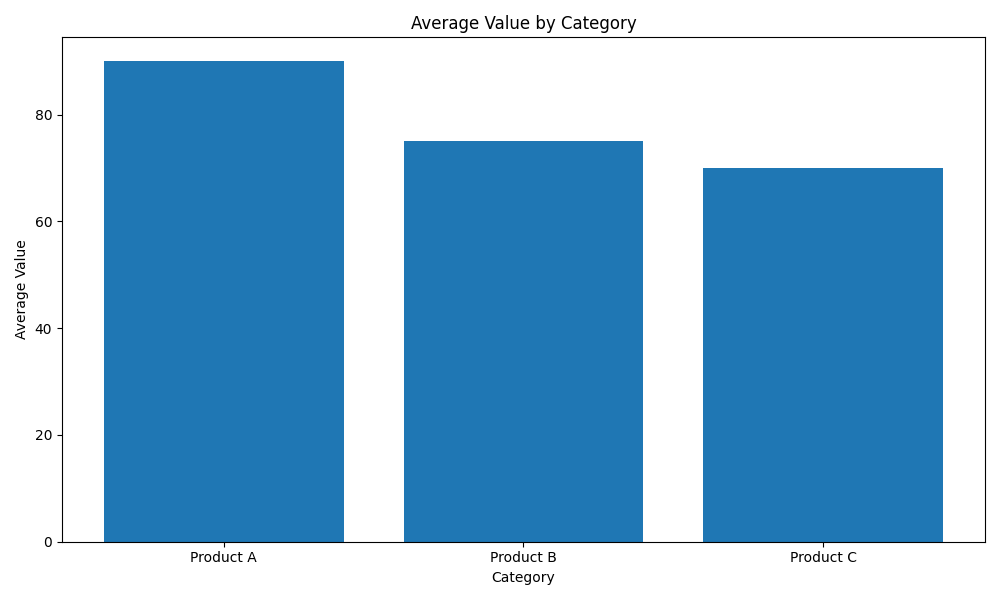
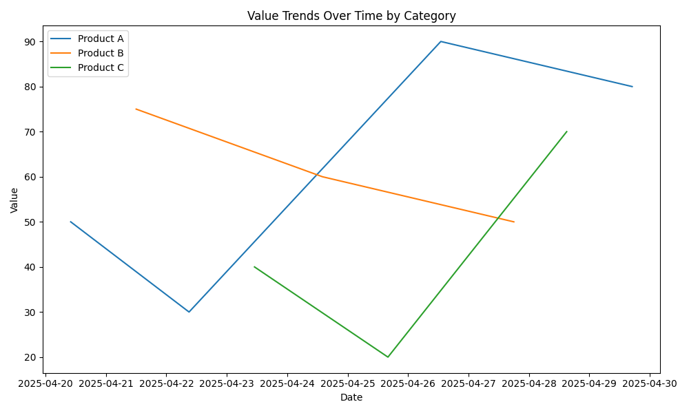

# Visualization

### How to View the Visualization

The dashboard is generated by the code and visualizes the mock data stored in MongoDB.

To view the dashboard:

1. Make sure the data has been inserted into MongoDB.
2. Run the Python visualization script
3. The script uses libraries including mstplotlib to create visual charts from the data.

Below is a screenshot of the dashboard output:

### Plot 1: 

### Plot 2:

